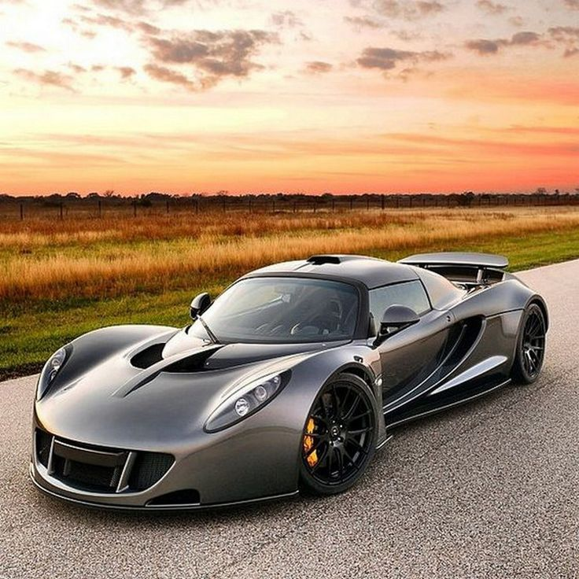

<!DOCTYPE html>
<html lang="en">
<head>
    <meta charset="UTF-8">
    <meta name="viewport" content="width=device-width, initial-scale=1.0">
    <title>World Fastest Cars</title>
</head>
<body>
<header>
<h1>Top 5 World Fastest Cars</h1>
<h4>In this webpage we will go from fastest to fast cars</h4>
</header>
    <ol>
    <li>Koenigsegg Jesko absolut</li>
    <li>Bugatti Chiron Super Sport 300+</li>
    <li>Koenigsegg Agera RS</li>
    <li>SSC Tuatara</li>
    <li>Hennessey Venom GT</li>
    </ol>
    
<a href="https://www.koenigsegg.com/model/jesko-absolut"><b>Koenigsegg Jesko Absolut:</b></a>
        
Designed for extreme high-speed stability, the Jesko Absolut is projected to reach a top speed of 482 km/h (300 mph). It features a 5.0-liter twin-turbocharged V8 engine producing 1,600 horsepower.

         
<a href="https://www.bugatti.com/en/models/chiron-super-sport-300"><b>Bugatti Chiron Super Sport 300+:</b></a>
        
In 2019, this Bugatti model became the first production car to exceed 300 mph, achieving a top speed of 304.77 mph (490.48 km/h). It is powered by an 8.0-liter quad-turbocharged W16 engine delivering 1,577 horsepower.

         
<a href="https://www.koenigsegg.com/model/agera-rs"><b>Koenigsegg Agera RS:</b></a>
        
In 2017, the Agera RS set a new record for the world's fastest production car with an average speed of 277.87 mph (447.19 km/h). It features a 5.0-liter twin-turbocharged V8 engine delivering 1,341 horsepower.

         
<a href="https://www.sscnorthamerica.com/model/tuatara"><b>SSC Tuatara:</b></a>
        
In 2020, the SSC Tuatara achieved a verified top speed of 282.9 mph (455.3 km/h) during a speed run. It is equipped with a 5.9-liter twin-turbocharged V8 engine producing 1,750 horsepower.

         
<a href="https://www.venomgt.com/"><b>Hennessey Venom GT</b></a>
        
In 2014, the Venom GT reached a top speed of 270.49 mph (435.31 km/h). It is powered by a 7.0-liter twin-turbocharged V8 engine generating 1,244 horsepower.

        

</body>
</html>
